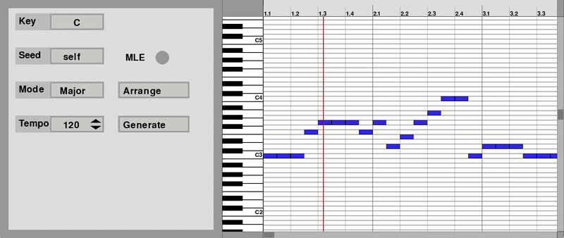
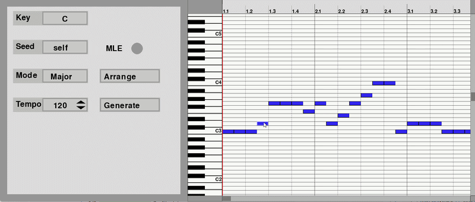
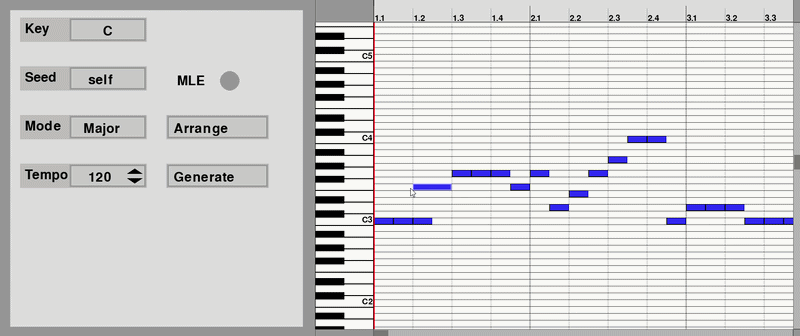

# Automatic Composition DAW

自動メロディ生成システムです。

本システムは、LSTMを用いて学習したメロディ生成モデルとMIDIベースのピアノロールエディタを組み合わせ、ユーザがメロディ生成・編集・再生を行える環境を提供します。
<p align="center">
  
</p>

---

## システム概要

本システムでは、

* メロディ自動生成
* キー変更
* モード変更（Major / Minor）
* テンポ変更
* MIDI編集
* MIDI保存
* MIDI再生

をGUI上で行うことができます。

---

## 主な機能

### メロディ生成

学習済みLSTMモデルを利用してメロディを生成します。

生成時には以下を指定できます。

* Key
* Mode
* Tempo
* Seed方式
* MLE生成

---

### ピアノロール編集

生成されたメロディはピアノロール上で編集できます。

* ノート追加
* ノート移動
* ノート長変更
* ノート削除

---

### 自動編曲

既存メロディを指定したKey・Modeへ変換できます。

---

### MIDI出力

編集結果をMIDIファイルとして保存できます。

---

## システム構成

```text
MIDIデータ
      ↓
音符列抽出
      ↓
Pitch / Duration
      ↓
系列データ化
      ↓
LSTMモデル
      ↓
メロディ生成
      ↓
ピアノロール編集
      ↓
MIDI保存・再生
```

---

## 実行環境

* Python 3.10
* TensorFlow
* NumPy
* Pygame
* PrettyMIDI
* Mido
* python-rtmidi

---

## インストール

```bash
pip install -r requirements.txt
```

---

## 実行方法

```bash
python AutomaticComposition.py
```

---

## スクリーンショット

### メロディ再生

<p align="center">
  
</p>


### ピアノロール編集

<p align="center">
  
  
</p>


---

## 注意

本リポジトリには学習データおよび学習済みモデルは含まれていません。

必要に応じて独自に学習済みモデルを配置してください。

---

## 開発

関西学院大学
岡田 拓己
